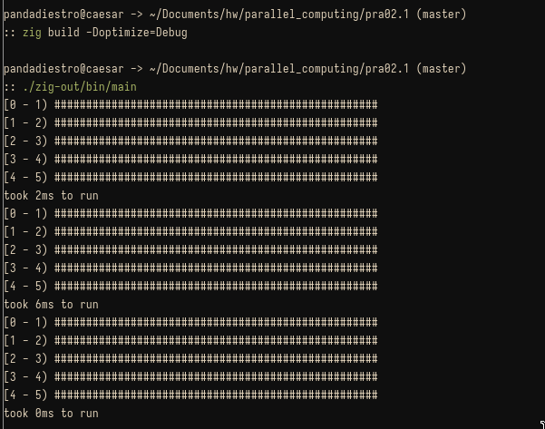

## Ejercicio del histograma

- Lenguaje utilizado: [zig](https://ziglang.org) 0.15.1
- Mecanismo de paralelización: Thread Pool + Pthreads

El ejercicio pedía clasificar datos aleatorios dentro de 5 grupos de un
histograma: `[0;1)`, `[1;2)`, etc. y comparar la eficiencia de clasificación de
un algoritmo de clasificación serial con uno paralelo.

Antes de mostrar el código que se usó para el experimento, se mostrará una
captura de los resultados obtenidos:



*El primer resultado fue realizado con un algoritmo puramente serial, el segundo
con una paralela no optimizada y el tercero con una optimizada.*

El volumen de datos fue de `100000` numeros de punto flotante de 32 bits entre 0
y 5 generados aleatoriamente usando la maquina de
[Xoshiro256++](http://xoroshiro.di.unimi.it) con la seed `2025`.

### Non threaded

Para la versión serial simplemente se iteró sobre cada valor de la lista
aleatoria, clasificándolos como era necesario.

El slice `tags` es el que contiene las cantidades por cada "tag" (rango), donde
cada cantidad es representada simplemente por un `usize` (equivalente a un u64).

```zig
pub fn nonThreaded(array: []f32) void {
    const time_start = std.time.milliTimestamp();

    var tags: [tags_amount]usize = @splat(0);
    for (array) |elem_f| tags[classify(elem_f)] += 1;

    return hist(tags[0..],
                std.time.milliTimestamp() - time_start);
}
```

Esta versión de por si es bastante rápida pues accede de forma lineal a la data,
patrón que es mas fácil de optimizar por parte del prefetecher de cache del CPU
y la cache en general.

### Threaded, non optimized

Para la versión paralela, debido a que la información de cada tag se está
compartiendo entre threads, envolví cada contador en una estructura síncrona con
un Mutex, de la siguiente forma:

```zig
const Tag = struct {
    value: usize = 0,
    lock: std.Thread.Mutex = .{},

    pub fn inc(self: *Tag) void {
        self.lock.lock();
        self.value += 1;
        self.lock.unlock();
    }

    pub fn sum(self: *Tag, value: usize) void {
        self.lock.lock();
        self.value += value;
        self.lock.unlock();
    }
};
```

De ese modo, la función de clasificación paralela fue la siguiente:

```zig
pub fn threaded(array: []f32) void {
    var tags: [tags_amount]Tag = @splat(.{});

    var new_arena: std.heap.ArenaAllocator = .init(std.heap.page_allocator);
    const allocator = new_arena.allocator();

    defer new_arena.deinit();

    var thread_pool: std.Thread.Pool = undefined;
    thread_pool.init(std.Thread.Pool.Options{
        .allocator = allocator,
    }) catch unreachable;

    var wg: std.Thread.WaitGroup = .{};

    const time_start = std.time.milliTimestamp();

    for (0..parallel_partitions) |part_idx| {
        const offset = part_idx * (numbers_amount / parallel_partitions);
        var upper = offset + numbers_amount / parallel_partitions;
        if (numbers_amount - upper < parallel_partitions) {
            upper += numbers_amount - upper;
        }

        thread_pool.spawnWg(&wg, threadProcessUnit, .{
            array[offset..upper],
            tags[0..],
        });
    }

    thread_pool.waitAndWork(&wg);
    return histParallel(tags[0..],
                        std.time.milliTimestamp() - time_start);
}
```

Como se puede ver en:

```
    var thread_pool: std.Thread.Pool = undefined;
    thread_pool.init(std.Thread.Pool.Options{
        .allocator = allocator,
    }) catch unreachable;

    var wg: std.Thread.WaitGroup = .{};
```

Usé una thread pool como mecanismo de paralelización, que a su vez hace uso de
las threads de POSIX para su implementación.

Además, coordiné la ejecución de las threads en paralelo con un wait group, de
ese modo se puede esperar por el resultado final de todas las threads, sin
retornar de forma imprevista data inválida.

Luego, cada thread por detrás llamó a `threadProcessingUnit`, que tiene la
siguiente estructura:

```zig
pub fn threadProcessUnit(array: []f32, tags: []Tag) void {
    for (array) |elem_f| tags[classify(elem_f)].inc();
}
```

Básicamente lo mismo que la versión non-threaded, solo que particionado en 12
(que es el número de threads de hardware que soporta mi cpu sin context
switching) y síncrono para las tags.

Sin embargo, este diseño tiene un problema que hace que sea mucho mas lento que
la versión serial, y es que al bloquear la tag de clasificación de cada valor que
se calculó, se está generando una cantidad muy grande de contención, acentuada
por el gran volumen de datos.

No solo esto, sino que con cada load que se hace en `tags`, se está invalidando
la línea de cache de todas las threads que contienen a `tags`, forzándolas a
hacer refetching constantemente, lo que es un problema de `cache coherence`.

Ahora, para solucionar este problema, nos podemos basar en la solución al
problema de cache coherece mostrado por scott meyers en ["CPU caches and why you
care"](https://www.youtube.com/watch?v=WDIkqP4JbkE), donde cada worker thread
manipula únicamente un valor dentro de su stack local y se realiza la carga de
datos una única vez al final del procesamiento.

### Threaded, Optimized

La unidad de procesamiento para cada partición ahora fue:

```zig
pub fn threadProcessUnitOptimized(array: []f32, tags: []Tag) void {
    var local_tags: [tags_amount]usize = @splat(0);
    for (array) |elem_f| local_tags[classify(elem_f)] += 1;

    for (0..local_tags.len) |idx| {
        tags[idx].sum(local_tags[idx]);
    }
}
```

Se puede notar que se ha hecho que todo el procesamiento y clasificación ocurra
sobre una versión local de las tags, traspasándose a las tags reales sólo una vez
al final de la ejecución. Esto reduce la cantidad de cache misses entre threads y
la cantidad de contención, además de que es más facil de optimizar por el
compilador.

Los resultados hablaron por sí mismos, la versión paralela optimizada abatió con
las otras 2, incluso para un volumen así de grande de datos.


